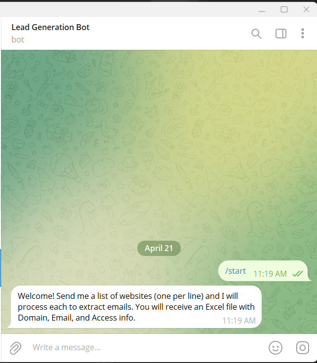
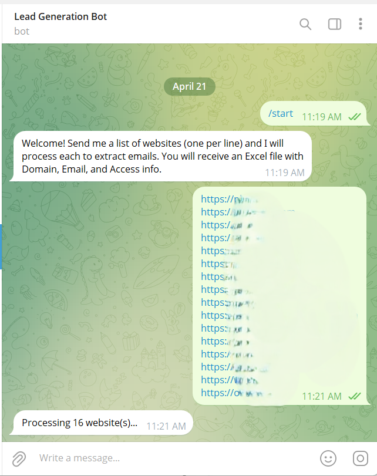
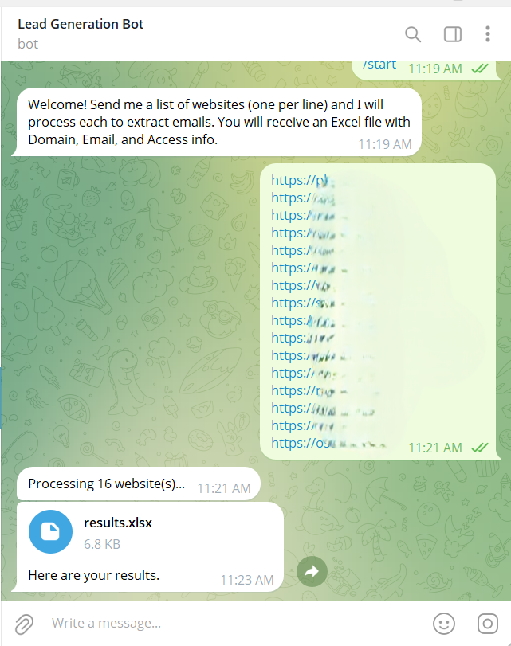
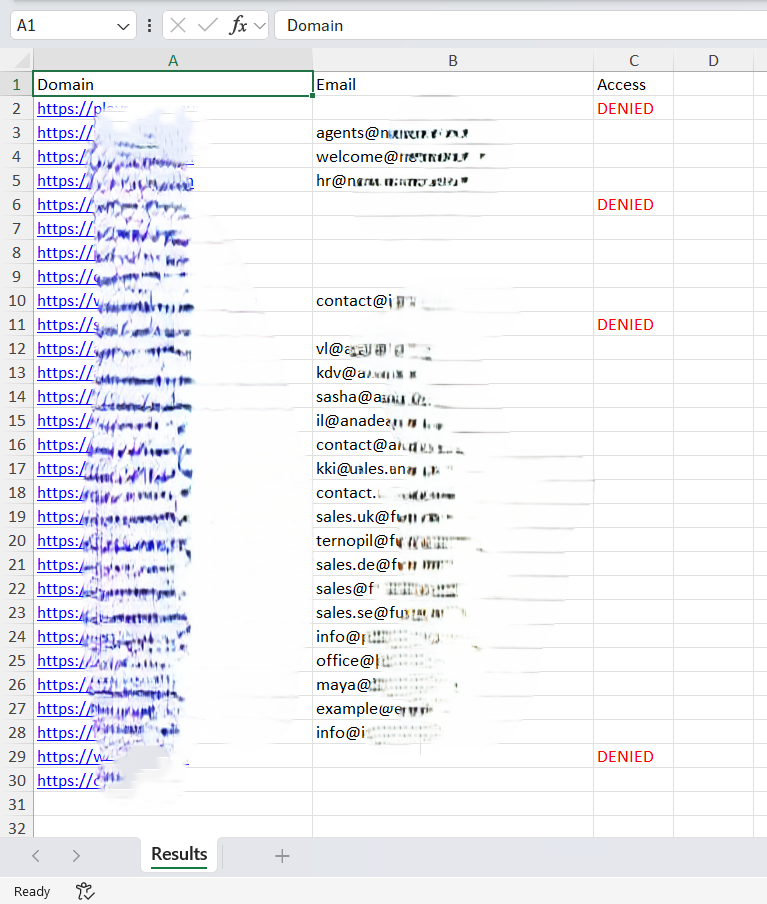

# Website Email Crawler

A multi-interface web crawler that extracts and validates email addresses from websites. This project provides three ways to interact with the crawler: Command-line interface, web-based GUI, and Telegram bot.

## Features

- 🌐 **Multi-interface support**: CLI, Streamlit web GUI, and Telegram bot
- 📧 **Email extraction**: Automatically finds and extracts emails from websites
- ✅ **Email validation**: Checks email format and deliverability
- 🤖 **Robots.txt compliance**: Respects website crawling policies
- ⚡ **Concurrent processing**: Processes multiple domains in parallel (5 workers)
- 💾 **Database storage**: Stores results in SQLite database
- 📊 **Excel export**: Generates Excel files with results
- 🛡️ **User-Agent rotation**: Randomizes headers to avoid detection
- 📱 **Contact page detection**: Intelligently finds contact pages on websites

## Screenshots

**Step 1: Start the Bot**


**Step 2: Send Websites List**


**Step 4: Receive Results**


**Step 5: Download Excel File**


## Project Structure

```
├── main.py              # Command-line interface for batch domain processing
├── gui.py               # Streamlit web interface
├── tg_bot.py            # Telegram bot interface
├── crawler.py           # Core web crawling and HTML fetching logic
├── bot.py               # Email extraction rules and contact page detection
├── utils.py             # Utility functions (email validation, extraction)
├── specialists.py       # Specialized domain handlers
├── config.py            # Configuration and headers
├── domains.txt          # Input file containing domains to process
├── requirements.txt     # Python dependencies
├── results.csv          # Output file with extraction results
└── results.db           # SQLite database with email results
```

## Requirements

- Python 3.8+
- All dependencies listed in `requirements.txt`

## Installation

### 1. Clone/Setup the project
```bash
cd path/to/crawler
```

### 2. Create a virtual environment (recommended)
```bash
python -m venv venv
.\venv\Scripts\activate  # Windows
source venv/bin/activate  # macOS/Linux
```

### 3. Install dependencies
```bash
pip install -r requirements.txt
```

### 4. Set up environment variables
Create a `.env` file for sensitive configuration:
```
TELEGRAM_BOT_TOKEN=your_token_here
```

## Usage

### Command-Line Interface
Process domains from a file:
```bash
python main.py
```

The script will:
1. Read domains from `domains.txt`
2. Process each domain concurrently
3. Extract and validate emails
4. Store results in SQLite database
5. Export results to CSV/Excel

### Web GUI (Streamlit)
Launch the interactive web interface:
```bash
streamlit run gui.py
```
Then open your browser and follow the on-screen instructions to:
- Enter website URLs
- Extract emails
- Download results as CSV/Excel

### Telegram Bot
Start the Telegram bot:
```bash
python tg_bot.py
```

Send your Telegram bot a list of websites (one per line) and receive:
- Extracted emails
- Access status for each domain
- Excel file with results

**Note**: Requires a valid `TELEGRAM_BOT_TOKEN` in your `.env` file.

#### Telegram Bot Conversation Examples

**Step 1: Start the Bot**


**Step 2: Send Websites List**


**Step 3: Processing Domains**


**Step 4: Receive Results**


**Step 5: Download Excel File**


## Key Components

### `crawler.py`
- **`fetch_html(url)`**: Fetches HTML content from a URL with proper headers and delays
- **`can_fetch_url(url)`**: Checks robots.txt permissions before fetching
- **`get_random_headers()`**: Returns randomized request headers to avoid detection

### `bot.py`
- **`find_contact_pages(base_url)`**: Identifies contact-related pages on a website
- **`extract_emails_from_urls(urls)`**: Extracts email addresses from given URLs
- Intelligently searches common contact page patterns

### `utils.py`
- **`is_valid_email(email)`**: Validates email format
- **`is_deliverable_email(email)`**: Checks if email domain has valid MX records
- **`extract_emails(text)`**: Extracts emails from text using regex

### `main.py`
- **`process_single_domain(domain, idx)`**: Processes a single domain and extracts emails
- **`process_domains(domains)`**: Processes multiple domains in parallel
- **`insert_into_db(results)`**: Stores results in SQLite database

## Configuration

Edit `config.py` to customize:
- User-Agent strings
- Request headers
- Default timeout values
- Database settings

## Output Files

- **`results.csv`**: Comma-separated values with domain and email pairs
- **`results.db`**: SQLite database with structured email results
- **Excel files**: Generated when using GUI or Telegram bot

## Features in Detail

### Email Extraction Strategy
1. Fetch website HTML
2. Identify contact-related pages
3. Search for email patterns in HTML
4. Validate found emails

### Email Validation
- **Format check**: Validates email structure (regex-based)
- **Deliverability check**: Verifies MX records for email domain
- Filters out invalid or disposable emails

### Rate Limiting
- 1-2 second random delays between requests
- Respects robots.txt crawling rules
- Reuses HTTP connections for efficiency

## Error Handling

The crawler gracefully handles:
- Unreachable websites
- robots.txt restrictions
- Invalid email addresses
- Network timeouts
- SSL certificate issues

## Performance

- **Concurrent workers**: 5 parallel threads by default
- **Processing time**: ~2-5 seconds per domain (depending on website size)
- **Batch size**: Limited only by available memory and API rate limits

## Troubleshooting

### Telegram Bot not responding
- Verify `TELEGRAM_BOT_TOKEN` is set in `.env`
- Check internet connection
- Ensure bot is started: `python tg_bot.py`

### No emails found
- Website may not have accessible contact information
- Check if domain is properly formatted (include http/https if needed)
- Verify website isn't blocking requests (check robots.txt)

### Slow processing
- Default delay between requests is 1-2 seconds
- Reduce worker count in concurrent.futures.ThreadPoolExecutor if memory is constrained
- Check internet connection speed

## Dependencies Overview

- **beautifulsoup4**: HTML parsing and email extraction
- **requests**: HTTP requests with session management
- **pandas**: Data manipulation and Excel export
- **python-telegram-bot**: Telegram bot integration
- **streamlit**: Web GUI framework
- **python-dotenv**: Environment variable management
- **openpyxl, xlsxwriter**: Excel file generation
- **dnspython**: DNS lookups for email validation


## Contact

For questions or issues, please open an issue or contact the project maintainer.

---

**Note**: Always ensure compliance with websites' Terms of Service and robots.txt when using this crawler.
